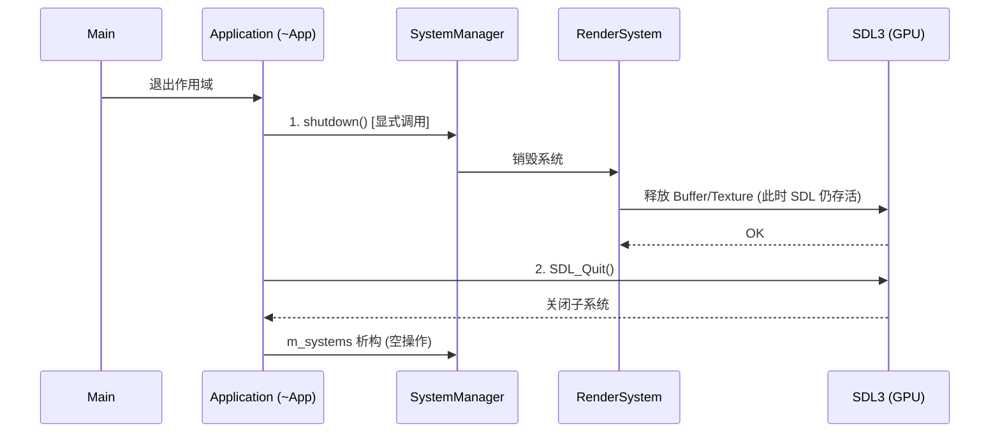

# UI 模块时序与初始化/销毁顺序分析报告

**日期**: 2026-02-04  
**模块**: Client / UI / Core  
**摘要**: 本文档详细分析了 UI 系统中存在的时序风险，特别是涉及 SDL GPU 资源管理、ECS 系统生命周期以及双重缓冲（Double Buffering）引入后的同步问题。同时记录了针对“应用程序退出崩溃”问题的修复逻辑。

---

## 1. 核心生命周期问题 (Lifecycle)

### 1.1 销毁顺序 (Destruction Sequence) - **关键修复**

**问题描述**:  
在 C++ RAII 机制下，对象的销毁顺序通常与构建顺序相反。但在 `Application` 类中，`SDL_Quit()` 被显式调用。

- **旧逻辑**: `Application` 析构函数中直接调用 `SDL_Quit()`。
- **风险**: `m_systems` (SystemManager) 是 `Application` 的成员变量。C++ 析构函数体（`~Application`）会先执行，然后才执行成员变量 `m_systems` 的析构函数。
    1. 执行 `~Application()` -> 调用 `SDL_Quit()` (SDL 子系统关闭，GPU 设备上下文丢失)。
    2. 执行 `m_systems.~SystemManager()` -> 销毁 `RenderSystem` -> 尝试释放 GPU Buffer/Texture。
    3. **结果**: 试图在已关闭的 SDL 环境中操作 GPU 资源，导致 Segfault 或 Driver Crash。

**当前方案 (Correct Sequence)**:
必须显式控制销毁顺序，确保 **Systems 在 SDL 关闭前完全清理**。



### 1.2 初始化顺序 (Initialization Sequence)

**现状**:

1. `ui::factory::CreateApplication` -> `SDL_Init` -> `SystemManager::registerAllHandlers`.
2. `client::view::CreateMenuDialog` -> 创建 Entity 和 Components in Registry.
3. `app.exec()` -> 开始渲染循环 -> `RenderSystem` 初始化 Device.

**潜在风险 (Race Conditions)**:

- **UI 实体创建 vs 渲染器就绪**: `CreateMenuDialog` 仅仅是在 ECS Registry 中创建数据（Components）。真正的 GPU 资源（如纹理上传）如果发生在 Component 创建阶段，会失败，因为此时 `RenderSystem::configure` 可能尚未运行，GPU Device 可能未配置。
- **规避现状**: 目前 `IconManager` 和字体渲染采用懒加载（Lazy Loading）或在 Render 循环中上传，规避了此问题。
- **警示**: 严禁在 `Create*` 函数中直接调用 SDL GPU API。必须将 GPU 操作推迟到系统 Update 阶段。

---

## 2. 渲染循环时序 (Render Loop Timing)

### 2.1 双重缓冲 (Double Buffering)

引入 `MAX_FRAMES_IN_FLIGHT = 2` 后，帧数据的生命周期管理变得复杂。

**资源竞争风险**:

- CPU 正在写入第 N+1 帧的 Uniform Buffer。
- GPU 可能正在读取第 N 帧的 Uniform Buffer。

**解决方案分析**:

- 我们的 `CommandBuffer` 实现使用了 `cycle` 机制 (SDL_MapGPUTransferBuffer with cycle=true) 或者手动管理 `frameworkIndex`。
- **时序图**:

    ```text
    Frame 0 (CPU): 准备数据 -> 提交 -> 等待 GPU (Fence 0, 仅在 Wrap 时)
    Frame 0 (GPU): ............ 渲染 ............
    Frame 1 (CPU): 准备数据 -> 提交 -> (此时 GPU 可能还在处理 Frame 0)
    ```

- **关键点**: `RenderSystem` 必须确保在 `AcquireCommandBuffer` 只有在确定可以安全写入时才进行。SDL3 内部通常处理了 Swapchain 带来的阻塞，但在 Buffer 更新上，如果不轮转 Buffer，会导致画面撕裂或数据错乱。

### 2.2 任务链 (Task Chain)

当前主循环逻辑：

```cpp
auto taskChain = tasks::QueuedTask{} | tasks::InputTask{} | tasks::RenderTask{};
```

**时序**:

1. **QueuedTask**: 处理用户在非主线程（如果存在）或上一帧回调中入队的操作。
2. **InputTask**: 处理 SDL 事件（鼠标、键盘）。
    - *风险*: 如果 InputTask 修改了 UI 组件状态（例如删除一个按钮），而 Registry 没有通过命令缓冲（CommandBuffer of ECS）进行延迟删除，可能会导致后续 `RenderTask` 访问悬空引用。
    - *建议*: 所有结构性变更（Create/Destroy Entity）应在帧首或帧尾统一处理，或使用 EnTT 的安全视图。
3. **RenderTask**: 读取 Registry，生成 DrawCall。
    - *必须*: 此时不能再有写入 Component 的操作，除非是专门的渲染状态（如动画进度）。

---

## 3. 建议与检查清单 (Checklist)

为防止未来出现时序 Bug，请遵循以下原则：

1. **Strict Lifecycle**: 不要在全局静态变量中持有 SDL 资源（Texture/Surface）。它们的析构可能晚于 `SDL_Quit`。使用 `ResourceCache` 并在 `SystemManager::shutdown` 中清理。
2. **Explicit Shutdown**: 修改任何 Manager (如 `IconManager`, `FontManager`) 时，确保它们提供 `cleanup()` 或 `shutdown()` 方法，并由 `Application` 或 `SystemManager` 统一调用。
3. **No Early GPU Access**: 任何 View 层代码（`CreateMainWindow` 等）只负责写数据到 Registry，绝不触碰 `RenderContext` 或 `DeviceManager`。
4. **Buffer Rotation**: 如果添加新的动态 Buffer（如粒子系统数据），必须实现多帧轮转（Ring Buffer）或每帧重新分配（如果是 TransferBuffer），防止 GPU 读写冲突。

